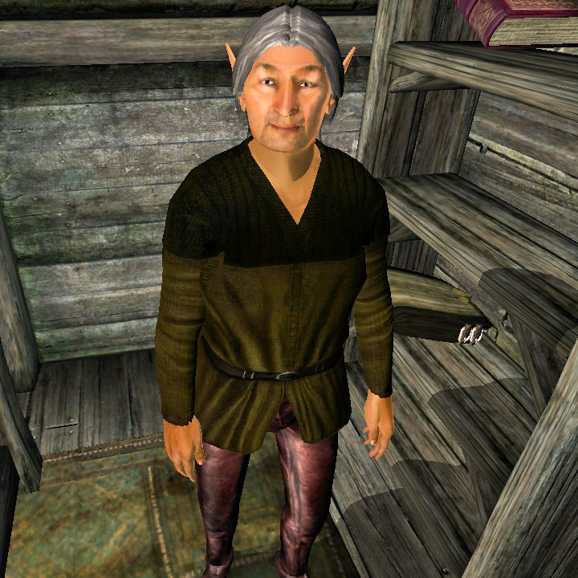

“So you sell…?"

“Skooma, right. What’s the matter? Can’t say it?"

“No, it’s just that…"

“What? It’s distasteful? It’s disgusting? It’s immoral? Let me tell you
something, nothing in this life is immoral if you don’t treat it as such. The
most successful people in Tamriel are those who ignore morals and just do what
they want. Look at Tiber Septim for example, he killed thousands in his wars of
conquest and he got to become a GOD. Now you tell me, if I killed thousands and
become Nordinor the Mighty would you bow down and kiss my boots? You better
believe you won’t unless I dress it up real nice and pretend it’s for the
greater good.”

“You seem really defensive. Do people often preach to you about what you’re
doing?"

“Fetch[^1] yes I'm angry. Who wouldn’t be? I came here with nothing, just like
everyone else and I'm the only guy out of hundreds of degenerates to make
something of myself. Tell you what, next time you see a relative of mine in
Valenwood squatting in the mud eating an arm, you tell him what an evil guy
Nordinor is because he lets people get high.”

Note: We stood in silence for a few seconds. Nordinor then speaks again.

“Buy something or get the fetch out"

[^1]: Sorry about the language.
