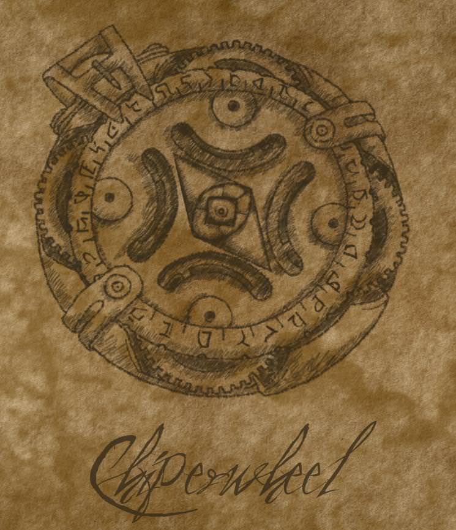

> (This small book appears to be a loosely handwritten herbal pamphlet,
> detailing flowers and flora native to Skyrim. The Nightshade entry on the
> first page is strangely out of alphabetical order and has nonsensical writing
> at the end of the paragraph:
>
> “**yqdcbmt nlxrz**…”, “**emj cblyirp**…”, and “**fqrcxjzaoxf**…”
>
> Utilizing a cipherwheel – a rare, clandestine Guild tool – with the encryption
> keyword “Nightshade”, the words are decoded as “**Lixivium Niter, Red
> Vitriol,** and **Silversalts**”, respectively. When swathed in an alchemical
> elixir of the listed ingredients, invisible ink appears over the paper,
> entailing the true message.)
>
> 

{:tag="aside" .foreword}

---

_F,_

This is the first of what will likely be several reports from the Rift guild.
Yes, this letter is two and a half weeks late, but trust that is not due to
idleness or apathy but rather because Skyrim is a miserable, hellacious, frigid
dunghole. The wagon driver that you hired is dead, killed in a haphazard Legion
ambush at the border. You employed a fool, and the blisters and frostbite on
this one’s paws speak to his failure. It has been a terribly arduous journey, no
thanks to your most _well-laid arrangements_, but _Z_ has finally reached the
rogue chapter. From what _Z_ has observed so far, it would seem as if your
concerns are well justified. Operations are in a state of absolute disarray,
with the fetor of insubordination and backroom dealings filling Khajiit’s
nostrils. Although, perhaps that’s because they’re harbored in a _literal
cesspool_…

Not but four hours after arriving in Riften this one was approached in the
tavern by the Rift Guildmaster’s Doyen, known by the alias “Brynjolf”. The Nord
caused a considerable bit of alarm, as he identified Jo’Khajiit as a thief
almost immediately, and this one reckoned his cover to be compromised. This
fared to be little more than a recruitment tactic rather than an unrhetorical
inquest, likely based on the assumption that this one _looked_ the part of a
burglar. Gaining access to the city itself was difficult for Khajiit, and it is
no question as to whether or not it was my fur and tail that the Doyen based his
assumption. A strange and rather prejudiced approach to chartering new footpads,
although correct in this particular instance. _Not all Khajiiti are criminals_.
_Z_ is simply a very poor example.

This one digresses… Following his declined offer to purchase some local swill
from the barkeep, Brynjolf enticed _Z_ to perform a task proving his competency.
Some Nord vigilante had been sticking her nose into the Guild’s operations and
apparently vowed to singlehandedly slay them all. He’d like for Khajiit to teach
her a lesson for such foolishness by hoisting her weapon and replacing it with a
_sternly worded_ note. Death threats by dint of memoranda bring to mind Dark
Brotherhood conduct, yes? Seemed particularly unfitting to this one, as grew up
being trained to _avoid_ revealing the Guild’s existence. This was the first
indication that something about this provincial chapter was particularly
_defective_. He gave a deadline by nightfall, and the afternoon was nearly over,
so it’d have to be done in broad daylight. Simple enough.

Purloining the axe from the Nord was rather elementary. A line of friendly but
uncomfortable inquiry of an indecent nature and her vigilance was easily broken.
Posing as a foreign merchant speaking in broken Tamrielic, this one began asking
for directions and sociably began to impose the implication of a sexual affinity
with the Nord and her lickspittle companion that trailed her heels. In her
embarrassment, it took very little Illusion magic to create a retentive
blindspot, as Khajiit finds most Nords are susceptible to modest misdirection
and are also quite prudish. Battleaxe gently freed from the baldric, and the
shadowmarked letter stuffed in its place, _Z_ returned the prize to the Doyen.
He seemed impressed with this one’s skill and said to rendezvous at their
hideaway without delay. It is odd for _any_ guild to go out and approach
unscrupulous appearing characters on the street. _Z_ dismissed this as an act of
desperation on their behalf, but it would not be the last unconventional
practice that would be noticed.

The Guild’s sanctuary here is nestled in nauseating subterranean underworks
known as _the Ratways_, which is the _sole_ base of the chapter’s activity in
Skyrim, with a conspicuous pub serving laughably as a front. It would appear as
though the city’s municipal powers have been bribed or otherwise coerced into
not disturbing their enterprise, because there is no other way to explain why a
bar _in the damned sewers_ would still be uninvestigated. Brought into the main
cistern of the hideout by Brynjolf, Khajiit was informally introduced to the
Guildmaster of this chapter, whom you certainly already know by name. He was
forthwith with his suspicion of _Z_, even questioning any previous involvement
with the Guild, but thankfully this one is apt at acting a convincing simpleton
_incapable of sabotage_. His outright apprehension of _Z_ only makes this
chapter that much more suspect, and Jo’Khajiit is resolved to discover the
reason behind it.

While settling in to this one’s new quarters, conjoint to the rest of the cots
and arrayed around the ambit of the putrid-smelling aqueduct, new armor for
initiates was acquisitioned. It’s a leathered uniform, really, with bandoliers
and satchels attached. After receiving the gear, Khajiit quickly realized that
all operating Guild members wore this same equipment. The Guildmaster’s armor
even bears the chapter’s insignia. For what reason a clandestine criminal
society would dispense identifiable apparel to its faculty is absolutely beyond
comprehension. It would seem to _Z_ that they are not concerned with the nuances
of secrecy, owing to their supposed private influence in the city. It is still
sloppy, corruption or not. No matter how crooked the politician that the Guild
bribed, we would never shake their hand in public, no?

The junior members are a talkative bunch, most of them being puerile and
unversed in the higher points of _refined_ larceny. Most apparent is their lack
of savvy in sharing intimate information with complete strangers during
downtime; stangers who are in the _business_ of exploitation, no less. A few
drinks and some cordial discourse, and they are all too eager to ask _Z_ fatuous
questions like from where he hails, when he began his life of crime and what
brings him to Skyrim. Benign questions such as this would have gotten them a
knife in their belly in any other chapter… Reasoning new lies is becoming
tiresome, but more bothersome is seeing such blatant disregard for another
thief’s confidentiality. Basic Guild etiquette is lost here, though this one
blames the lack of proper leadership rather than the children. They come from
petty bandit gangs, the city gutters and prisons, and since their induction have
yet to be mentored in the manner of professionalism that distinguishes us from
common throngs of riffraff. Veteran bearing is learned by appropriate
experience, but flagrant carelessness is reprehensible. If Jo’Khajiit was not
undercover as an initiate, many a reprimand would be issued.

The other members, senior ones included, tell _Z_ that the Guild has _“fallen on
hard times”_. Reportedly, several recent heists have been foiled, with
misfortune being where they lay the fault. On top of that, they are not turning
nearly enough of a profit to keep their operations stable at this disastrous
rate. _“Bad luck”_, they say. Luck is real, of this we are all certain, but
there is only so much incompetence that you can blame on fortuity. As always
seems to be the case, there is a percentage of thieves here that talk of a
curse. This one has seen too much to outright doubt superstition, but perhaps it
is safe to say that the inadequate command has something to do with it?

We drank most of the night, sharing excited stories of our exploits, _as thieves
tend to do_. Spinning false tales of Elsweyr is peculiar, as this one has never
been there personally, but they are thankfully not well-traveled and liable to
believe one with claws. _Z_ is the only of his kind here. It occured to this one
that many of these northlanders have likely never seen a Khajiit before in their
lives, much less lived amongst one. The Nord bartender in particular was curious
about the shape of Khajiit’s legs, likely only aware of Cathay, prodding rudely
at his knees. They are not yet suspicious of this one so far, but the
unnecessary interest is disconcerting. Perhaps you had not considered, when
selecting a single spy to send to a foreign land hundreds of miles away, that
they could have been someone who’s mere _appearance_ wouldn’t yield unwanted
attention?

It is no matter; the mission goes _relatively_ well at the time of this writing…
Khajiit would just rather that you had sent _anybody_ else.

Once the drinks were gone and night had set in, _Z_ lingered patiently for his
opportunity to probe the ledgers. The thieves who hadn’t taken the occasion to
use the shroud of midnight to go filch were fast asleep. Unfortunately, the
Guildmaster’s desk was out in plain sight and still being attended by him. From
what this one has heard, he is rarely not present in the cistern itself. This
was aggravating, and Khajiit lingered in his bed for much longer than he
expected to have to. Just as it appeared as if he was about to retire from his
desk, the Guildmaster nimbly gathered his documents in a leather binder and left
the hideout with them in hand. The anger subsided once _Z_ spotted a single
half-crumpled article roll silently off the desk in his haste. Khajiit had to
move quickly as he feared the dripping water and puddles would turn potential
evidence into pulp. This one tried to keep a low profile, swiftly moving on all
fours, but unfortunately thieves tend to be light sleepers.

Evidently, the chapter _has_ been working hard. _Very hard_, according to this
budgetary balance sheet. Numerous reports of forgeries, exhortation, heists and
thousands of drakes worth of fenced goods have been listed recently. A great
deal of the record was solely dedicated to some kind of racketeering deal with
one _“Blackbriar Meadery”_ What’s uncanny is that the Guild’s budgetary register
does not reflect the amount of product moved, and by result, it would appear as
if the Guild’s funds are severely lacking. The chapter _should_ be in a better
position than they find themselves, but for whatever reason, the gold is just
not there. They live in a sewer, so _Z_ does not imagine that they have very
many financial obligations to uphold. Where could it all be going?

A Bosmer that Jo’Khajiit has forgotten the name of approached this one before
more information could be annexed. The elf asked what _Z_ was up to, _“in the
middle of the night”_. This one deflected the question, speaking in a thick
Ta’agra accent of how Arzurah made Khajiiti eyes for the darkness of twilight,
and it feels like a dreadful waste to sleep the whole night through. Irksomely,
he persisted to pester with insipid questioning. Pretending not to understand
the question, _Z_ managed to slip away from the s’wit, rambling Elsweyrian
proverb.

This one now sits here, alone in a dark chamber of the Ratways, writing this
report. Many questions remain unanswered and it is too early to declare if a
mutiny does, in fact, exist.

Something is truly amiss here, and although he has yet to find the evidence, it
causes Khajiit’s whiskers to twitch. There is a rousing sense of danger in this
place, as _Z_’s new guildmates are clearly not above committing violence against
saboteurs. The last place that this one envisioned dying would have been a
festering, sodden gutter in Skyrim. Expect a new report soon. _You know what it
means if it never arrives._

**Z.**
